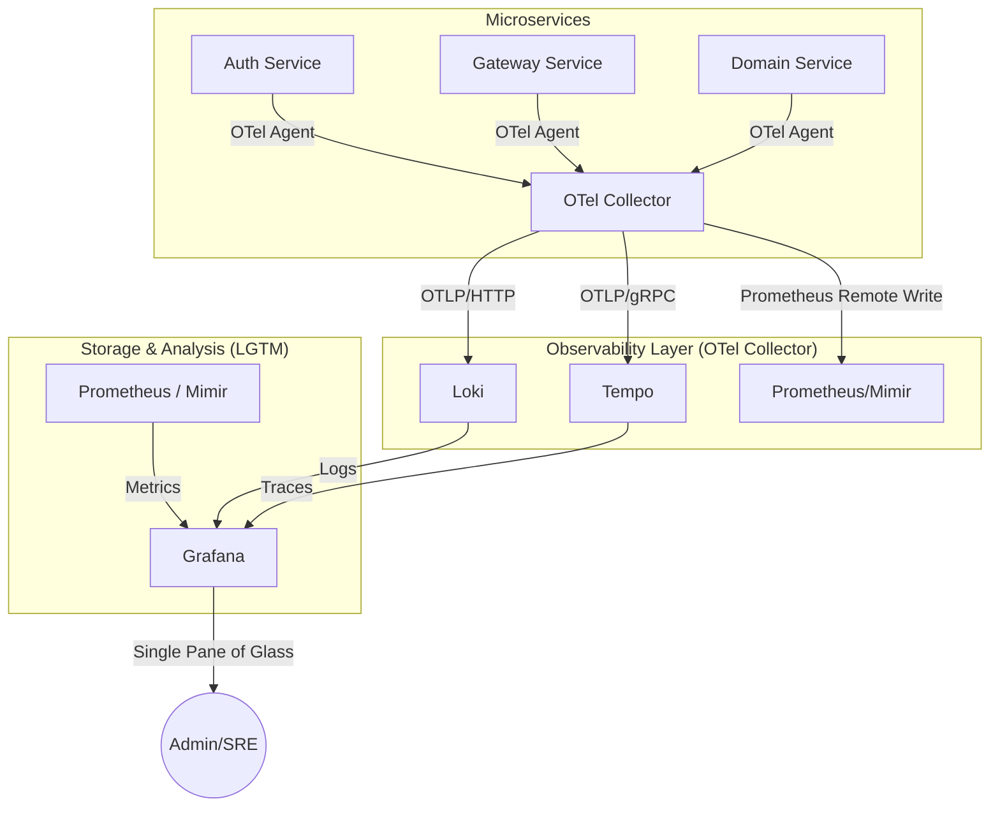

# Hệ thống Quan sát Toàn diện (Observability) với LGTM Stack

Tài liệu này hướng dẫn kiến trúc và lộ trình triển khai hệ thống theo dõi (Monitoring), quản lý Log và Tracing sử dụng bộ công cụ **LGTM (Loki, Grafana, Tempo, Mimir)** kết hợp với **OpenTelemetry**.

## 1. Kiến trúc Tổng thể (High-Level Architecture)

Hệ thống hoạt động dựa trên nguyên tắc **Push-based** sử dụng OpenTelemetry làm trung tâm:

---

## 2. Các thành phần trong Stack

### 2.1. Grafana (The Visualization)
- **Vai trò:** Trung tâm hiển thị dữ liệu.
- **Tính năng chủ chốt:** 
    - Dashboard tổng hợp sức khỏe hệ thống.
    - Truy vấn trực tiếp từ Loki, Prometheus và Tempo.
    - **Data Link:** Khả năng click từ một TraceID trong Log để nhảy sang biểu đồ Tracing của Tempo.

### 2.2. Loki (The Logging)
- **Vai trò:** Lưu trữ và quản lý Log tập trung.
- **Cơ chế:** Đánh chỉ mục (index) theo Labels (giống Prometheus) thay vì đánh toàn bộ nội dung (giống Elasticsearch).
- **Phù hợp:** Cực kỳ tối ưu cho Log định dạng JSON (Log4j2 JSON Layout).

### 2.3. Tempo (The Tracing)
- **Vai trò:** Theo dõi vết (Distributed Tracing).
- **Tính năng:** Lưu trữ các "Trace" (toàn bộ hành trình của một request qua nhiều microservices).
- **Tích hợp:** Sử dụng ID được sinh ra bởi OpenTelemetry Agent.

### 2.4. Prometheus & Mimir (The Metrics)
- **Vai trò:** Thu thập và lưu trữ thông số định lượng (CPU, RAM, Request Rate, Error Rate).
- **Mimir:** Cung cấp khả năng mở rộng (Scalability) và lưu trữ dài hạn cho Prometheus.

---

## 3. Lộ trình Triển khai (Roadmap)

### Giai đoạn 1: Chuẩn bị Infrastructure
- Cấu hình file `docker-compose-observability.yml` bao gồm:
    - Grafana, Loki, Tempo, Prometheus.
    - **OpenTelemetry Collector**: Đóng vai trò là trạm trung chuyển dữ liệu.

### Giai đoạn 2: Cấu hình Microservices
- Kích hoạt OpenTelemetry Java Agent (đã có sẵn trong Dockerfile).
    - Cấu hình các biến môi trường:
        - `OTEL_EXPORTER_OTLP_ENDPOINT=http://otel-collector:4317`
        - `OTEL_RESOURCE_ATTRIBUTES=service.name=auth-service`
- Cấu hình Log4j2 gửi Log qua OTLP hoặc để Loki thu thập qua file JSON.

### Giai đoạn 4: Dashboard & Alerting
- Import các dashboard mẫu cho Spring Boot, JVM, và Gateway.
- Thiết lập Alerting qua Email/Telegram/Slack khi hệ thống có lỗi hoặc phản hồi chậm.

---

## 4. Lợi ích vượt trội so với giải pháp truyền thống

1. **Khả năng liên kết (Correlation):**
    - Từ một lỗi trong log, bạn có thể xem ngay request đó đã đi qua những đâu, tốn bao nhiêu thời gian tại mỗi bước (Database, Kafka, Internal Service).
2. **Tiết kiệm tài nguyên:**
    - Loki tốn ít RAM và Storage hơn nhiều so với ELK Stack.
3. **Chuẩn hóa (Standards):**
    - Sử dụng hoàn toàn chuẩn OpenTelemetry (CNCF), không bị phụ thuộc vào một nhà cung cấp cụ thể (Vendor lock-in).

---

## 5. Yêu cầu Hệ thống
- **RAM:** Tối thiểu 4GB dành riêng cho Observability Stack (môi trường Dev).
- **Storage:** Khuyến khích sử dụng Docker Volumes hoặc S3-compatible storage (MinIO) để lưu trữ log/trace dài hạn.

---
> [!IMPORTANT]
> **Ghi chú:** Để bắt đầu, chúng ta cần đảm bảo các service trong dự án đã Log ra định dạng JSON và có chứa các trường `traceId`, `spanId` trong MDC (đã được thực hiện trong phiên làm việc trước).
